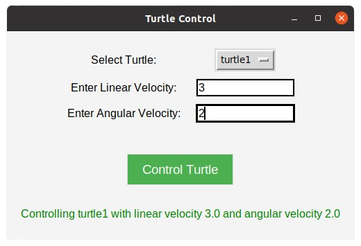
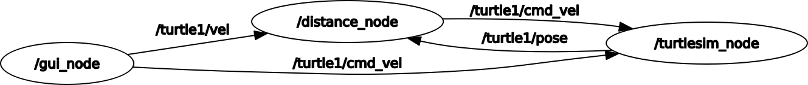

# Assignment 1 - Research Track I  

## Project Overview
This ROS package, `assignment1_rt`, was developed as part of Assignment 1 for the *Research Track I* course. The package includes three Python nodes (`gui`, `ui`, and `distance`) and two C++ nodes (`ui` and `distance`). These nodes work together to simulate and control a turtle environment with safety monitoring.

- **GUI Node (`gui`)**: Provides a graphical interface for controlling turtles using Tkinter.
- **UI Node (`ui`)**: Offers a command-line interface for turtle control.
- **Distance Node (`distance`)**: Monitors the distance between turtles and enforces safety boundaries.
- **Custom Message (`Vel.msg`)**: Handles the reversal of turtle direction upon collision.

---

## Nodes Description

### GUI Node (`gui`)
- **Purpose**: Provides a graphical user interface (using Tkinter) for controlling two turtles in the simulation.
- **Features**:
  - Allows the user to select between `turtle1` and `turtle2` using a dropdown menu.
  - Enables the user to input linear and angular velocities for the selected turtle.
  - Displays feedback messages about control actions (e.g., invalid inputs, successful commands).
  - Automatically stops the turtle's movement after 1 second of command execution.
  - Spawns `turtle2` at the position specified in the YAML configuration file (`x`, `y`, and `theta` values under `turtle2_pose`).
- **Execution**: Implemented in Python (`gui.py`).
- **Launch**: Automatically launched using the provided launch file (`demo.launch`).

#### GUI Screenshot
Below is an example of the graphical user interface for the project:

  
*Figure 1: GUI interface for turtle control.*

### UI Node (`ui`)
- **Purpose**: Provides a command-line interface for controlling two turtles (`turtle1` and `turtle2`).
- **Features**:
  - Spawns a new turtle (`turtle2`) with configurable initial parameters.
  - Allows users to select the turtle to control and set the velocity.
  - Commands run for 1 second before the turtle stops, allowing repeated user inputs.
- **Execution Options**: Available in both Python (`ui.py`) and C++ (`ui.cpp`).

### Distance Node (`distance`)
- **Purpose**: Monitors the distance between `turtle1` and `turtle2`, enforcing safety boundaries by reversing the direction of either turtle if they get too close to each other.
- **Features**:
  - Continuously calculates the distance between `turtle1` and `turtle2` and publishes this value to the `/turtle_distance` topic using `std_msgs/Float32` message type.
  - Subscribes to the `/turtle1/vel` and `/turtle2/vel` topics, where velocity commands for both turtles are published using the custom `Vel` message type.  
  - If the turtles are too close to each other (below the defined `distance_threshold`), the direction of the moving turtle is reversed by publishing the opposite velocity command to `/turtle1/cmd_vel` or `/turtle2/cmd_vel`.
  - This approach ensures the turtles avoid colliding by moving away from each other rather than stopping their movement completely.
- **Execution Options**: Available in both Python (`distance.py`) and C++ (`distance.cpp`).

---

## Custom Message (`Vel.msg`)
To reverse the direction of the turtle upon collision, a custom message (`Vel.msg`) was created. This was necessary because the `linear_velocity` in the default `/turtle1/pose` message always returns a positive value, even when negative velocities are commanded.

### Message Definition
```plaintext
float64 linear_velocity
float64 angular_velocity
```

By using this custom message, the turtle's linear and angular velocities are handled independently, enabling accurate reversal of motion.

---

## Node Graph

Below is the node graph illustrating the communication between nodes and topics in the project:

  
*Figure 2: Node graph for the project.*

---

## Configuration
A YAML configuration file is included in the `config/` folder to define parameters for the turtles and safety boundaries:

- **File**: `config/params.yaml`
- **Parameters**:
  - `turtle2_pose`: Sets the initial position (`x`, `y`) and orientation (`theta`) of `turtle2`.
  - `distance_threshold`: Distance threshold to stop the moving turtle.
  - `upper_boundary_limit` and `lower_boundary_limit`: Boundary limits to prevent turtles from moving out of bounds.

---

## Installation and Setup
1. **Install ROS Dependencies**:
   If you haven't already installed the necessary ROS dependencies, you can install them using the following commands:

   ```bash
   sudo apt-get update
   sudo apt-get install ros-<ros-distro>-turtlesim
   ```

   Replace `<ros-distro>` with your specific ROS distribution (e.g., `noetic`, `melodic`).

2. **Install Python Dependencies**:
   The GUI relies on `tkinter`, which is typically pre-installed with Python, but if not, you can install it using:

   ```bash
   sudo apt-get install python3-tk
   ```

3. **Clone the Repository**:
   ```bash
   mkdir -p ~/catkin_ws/src
   cd ~/catkin_ws/src
   git clone https://github.com/mohamedeyaad/assignment1_rt
   cd ~/catkin_ws
   catkin_make
   ```

4. **Source the Workspace**:
   ```bash
   source ~/catkin_ws/devel/setup.bash
   ```

---

## Launching the Project
A launch file is provided to streamline project execution with parameters pre-loaded.

### 1. Launch Command (for Python Nodes with GUI)
This command launches the `gui` and `distance` nodes using the Python implementations while loading parameters from the configuration file.
```bash
roslaunch assignment1_rt demo.launch
```
- **GUI Node**: Provides a graphical interface for turtle control.
- **Distance Node**: Monitors and enforces safety boundaries.

### 2. Running Python Nodes Separately
If you prefer to run the Python nodes independently, follow these steps:

#### a. Load Parameters Manually
```bash
rosparam load config/params.yaml
```

#### b. Run the UI Node (`ui.py`)
```bash
rosrun assignment1_rt ui.py
```

#### c. Run the Distance Node (`distance.py`)
```bash
rosrun assignment1_rt distance.py
```

> **Note**: Ensure that the YAML parameters are loaded before running the Python nodes to avoid missing parameter errors.

### 3. Running C++ Nodes Independently
If you prefer to run the C++ nodes without the launch file, follow these steps:

#### a. Run the UI Node (`ui.cpp`)
```bash
rosrun assignment1_rt ui
```

#### b. Run the Distance Node (`distance.cpp`)
```bash
rosrun assignment1_rt distance
```

These nodes are self-contained and do not require the YAML configuration file.

---

## Repository Structure
```
assignment1_rt/
├── config/
│   └── params.yaml               # YAML parameters file
├── launch/
│   └── demo.launch               # Launch file to run nodes
├── src/
│   ├── ui.cpp                    # UI node (C++)
│   ├── distance.cpp              # Distance node (C++)
├── scripts/
│   ├── gui.py                    # GUI node (Python, Tkinter-based)
│   ├── ui.py                     # UI node (Python)
│   ├── distance.py               # Distance node (Python)
├── msg/
│   └── Vel.msg                   # Custom message definition
├── images/
│   ├── node_graph.png            # Node graph visualization
│   └── gui_screenshot.png        # GUI screenshot
├── CMakeLists.txt
├── package.xml
└── README.md
```